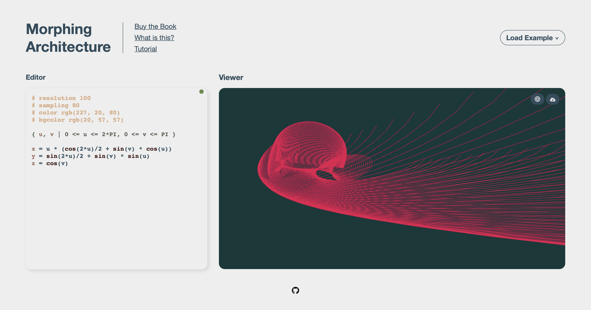

# An interactive editor for [Morphing Architecture](https://www.amazon.com/Morphing-Mathematical-Transformations-Architects-Designers/dp/1780674139/), the book.

## Play with the editor [here](https://morphing-architecture.onrender.com)

Play around with some of the examples contained in the book by using a custom DSL created to mirror the formulas contained therein. 

### Features:
- Custom DSL, allowing (pretty much) copy-and-paste from the book.
- Live-coding/Interactive editor. See your changes to the formulas and shapes reflected in real-time.
- PNG export.
- Customize the sampling rate, resolution, and colors of your shapes.
- Load and explore dozens of examples from the book.
- Syntax highlighting!
- Fully responsive site. Works just as well on a tablet/mobile.

### TODO:
- Use parser locations for syntax highlighting.
- Add support for variable assignment (in order to support more book examples).
- Fork THREEJS and bypass Point object creation for Curve sampling.
- Improve the tests they're a joke rn.
- Error messages for user while typing.
- Rhino point export.

### Contributing:
- Contributions more than welcome! Fork and submit a pull request.

